# The Rat's Garden 🌿 - AI Features Showcase

A modern digital garden built with Quartz 4, enhanced with AI-powered features for improved content discovery and creation. This repository contains the public code showcase of the AI features from [garden.samlazrak.com](https://garden.samlazrak.com).

## Overview

This directory contains my public code showcase of the AI features in garden.samlazrak.com. The private repository holds all content and development files, while the public repository displays only the source code and AI features.

## Features

### 🔍 AI-Powered Search

- **Hybrid Search Modes**: Switch between keyword, semantic, and hybrid search
- **Contextual Understanding**: Find related content even without exact keyword matches
- **Real-time Mode Switching**: Toggle search modes on the fly
- **Search Explanations**: Understand why results were matched

### 🎯 Personalized Content Recommendations

- **Three Modes**:
  - Related: Find similar content based on current page
  - Personalized: Recommendations adapt to your reading history
  - Trending: Discover popular and recently updated content
- **Privacy-First**: All personalization data stays in your browser
- **Smart Algorithms**: Combines tag similarity, content analysis, and reading patterns

### ✍️ AI Writing Assistant

- **Grammar & Style Checking**: Real-time suggestions for clarity and correctness
- **Content Suggestions**: Get ideas to expand and improve your writing
- **Smart Completion**: AI helps finish your sentences and paragraphs
- **Floating Interface**: Accessible from any content page without interrupting your flow

### 🎮 Interactive AI Demos

- **Browser-Based AI**: Experience machine learning directly in your browser
- **Multiple Demo Types**:
  - Text Classification & Sentiment Analysis
  - Image Classification
  - Text Generation
- **No Setup Required**: Models run using WebAssembly for near-native performance

### 🔗 Semantic Link Generation

- **Automatic Discovery**: AI identifies meaningful connections between content
- **Contextual Links**: Understand why content relates to each other
- **Visual Indicators**: Strength-based color coding for link relationships
- **Knowledge Graph**: Navigate interconnected ideas seamlessly

### 🎨 Canvas-Based AI Interactions

- **Visual AI**: Analyze and enhance diagrams and drawings
- **Obsidian Canvas**: Full support for Obsidian Canvas format
- **AI Enhancement**: Get suggestions for improving visual content
- **Interactive Creation**: AI-assisted diagram and drawing tools

## Getting Started

### Prerequisites

- Node.js 18+ and npm v9+
- Git

### Installation

```bash
# Clone the repository
git clone https://github.com/samlazrak/RatGarden.git
cd RatGarden

# Install dependencies
npm install

# Start development server
npm run dev

# Start development server with draft posts included
npm run dev-with-drafts
# or use the shell script
./scripts/dev-with-drafts.sh
```

Visit `http://localhost:8080` to see your digital garden.

### Building for Production

```bash
npm run build
```

The static site will be generated in the `public/` directory.

## Project Structure

```
RatGarden/
├── content/          # Your markdown content
│   ├── blog/        # Blog posts
│   ├── demos/       # Interactive demo pages
│   └── docs/        # Documentation
├── quartz/          # Quartz framework
│   ├── components/  # React/Preact components
│   │   ├── AISearch.tsx
│   │   ├── AIRecommendations.tsx
│   │   ├── AIWritingAssistant.tsx
│   │   ├── InteractiveAIDemo.tsx
│   │   ├── SemanticLinks.tsx
│   │   └── CanvasViewer.tsx
│   └── plugins/     # Build plugins
└── public/          # Generated static site
```

## Repository Structure

### Private Repository

Contains everything:

- All content files and media
- Build outputs and cache
- Development scripts and tests
- IDE settings and AI assistant data

### Public Repository

Contains only what's needed to showcase AI features:

- Quartz 4 static site generator code
- AI components and scripts
- Configuration files (sanitized)
- Documentation for AI features

## Single Commit History

The public repository keeps a single commit history. Each time the sanitization script runs:

- It creates a completely fresh copy
- Removes all sensitive data and private content
- Pushes the sanitized version with `--force` - only used in demo repos.
- This keeps the public repo clean and current without exposing development history for security purposes. This is a demo repo - not how I actually run and manage my repos.

## Configuration

### AI Features Configuration

In `quartz.layout.ts`, you can customize AI components:

```typescript
// AI Search with custom settings
Component.AISearch({
  enablePreview: true,
  searchMode: "hybrid",
  maxResults: 8,
  embeddingModel: "use",
})

// Personalized recommendations
Component.AIRecommendations({
  mode: "personalized",
  maxItems: 5,
  showDescription: true,
  explanations: true,
})

// Writing assistant (currently in mock mode)
Component.AIWritingAssistant({
  features: ["grammar", "style", "suggestions", "completion"],
  provider: "mock",
  position: "floating",
})

// Semantic links
Component.SemanticLinks({
  minSimilarity: 0.3,
  maxLinks: 8,
  showStrength: true,
  showExplanations: true,
  sentimentWeight: 0.3,
})
```

### Enabling Real AI Models

The writing assistant currently uses mock responses. To enable real AI:

1. Set up an edge function (Vercel/Cloudflare)
2. Add your API keys as environment variables
3. Update the provider in configuration:

```typescript
Component.AIWritingAssistant({
  provider: "gemini", // or "openai", "anthropic"
  apiEndpoint: "/api/ai-assistant",
})
```

#### Gemini Setup (Recommended)

The AI assistant is now configured to use Google's Gemini API by default. To set it up:

1. Get a Gemini API key from [Google AI Studio](https://makersuite.google.com/app/apikey)
2. Create a `.env` file with: `GEMINI_API_KEY=your_api_key_here`
3. Deploy with the environment variable set

See [docs/gemini-setup.md](docs/gemini-setup.md) for detailed setup instructions.

## Key Technologies

- **Quartz 4**: Static site generator optimized for digital gardens
- **Preact**: Lightweight React alternative for smaller bundle sizes
- **TypeScript**: Type-safe development experience
- **SCSS**: Advanced styling with variables and mixins
- **WebAssembly**: For running AI models in the browser
- **TensorFlow.js**: Browser-based machine learning
- **WebGPU**: GPU acceleration for AI computations

## Performance

- **Fast Searches**: Average query time under 50ms
- **Lightweight**: AI features add minimal overhead to page load
- **Progressive Enhancement**: Site works without JavaScript, AI features enhance the experience
- **Caching**: Intelligent caching for API responses and model outputs

## Privacy

- **Local Personalization**: Reading history and preferences stored only in browser
- **No Tracking**: No analytics or user tracking on AI features
- **Client-Side Processing**: Many AI features run entirely in your browser
- **Transparent**: All AI interactions clearly indicated

## Draft Management

By default, posts marked with `draft: true` in their frontmatter are excluded from the build. For local development, you can include all drafts using:

```bash
# Full development workflow with drafts
npm run dev-with-drafts

# Quick serve with drafts (if already built)
npm run serve-with-drafts

# Using the shell script
./scripts/dev-with-drafts.sh
```

You can also set the environment variable manually:

```bash
export QUARTZ_INCLUDE_DRAFTS=true
npm run dev
```

## AI Features Showcased

The public repository demonstrates:

### Interactive AI Demos

Real-time AI interactions embedded directly in the site. Users can interact with AI models through chat interfaces, image generation, and text processing without leaving the page.

**Technical Implementation:**

- **Component**: `quartz/components/InteractiveAIDemo.tsx`
- **Demo Types**: NLP (sentiment analysis), Vision (image classification), Generative (text generation)
- **Technology Stack**: WebAssembly + WebGPU for near-native performance
- **Models**: Transformers.js with Hugging Face models
- **Privacy**: All processing happens in-browser, no data sent to servers

**Architecture Diagram:**

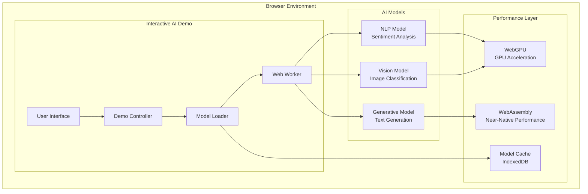

**Configuration Example:**

```typescript
Component.InteractiveAIDemo({
  demoType: "nlp",
  modelSource: "huggingface",
  fallbackBehavior: "api",
  title: "Sentiment Analysis",
  modelId: "distilbert-base-uncased-finetuned-sst-2-english",
})
```

**Garden Post**: [[demos/ai-interactive-demos|Interactive AI Demos]] - Experience AI in action with browser-based demos

### AI-Powered Search

Semantic search that understands context and meaning, not just keywords. Finds relevant content even when exact terms don't match, using vector embeddings and natural language processing.

**Technical Implementation:**

- **Component**: `quartz/components/AISearch.tsx`
- **Search Modes**: Keyword, semantic, hybrid
- **Embedding Model**: Universal Sentence Encoder (512 dimensions)
- **Build Integration**: `quartz/plugins/emitters/aiSearchIndex.ts`
- **Performance**: <50ms average query time with pre-computed embeddings

**Search Architecture:**

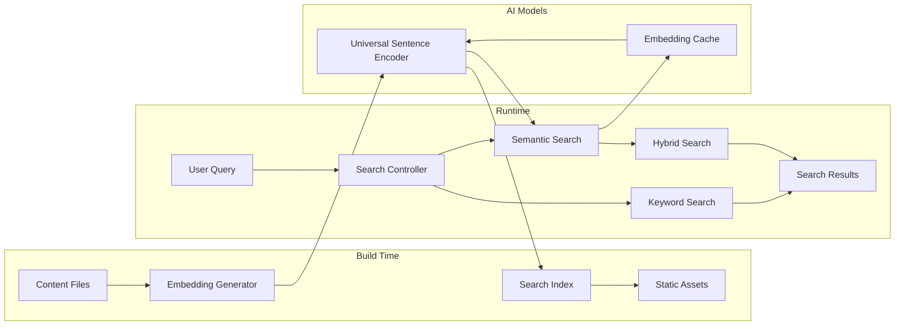

**Configuration Example:**

```typescript
Component.AISearch({
  enablePreview: true,
  searchMode: "hybrid",
  enableExplanations: true,
  maxResults: 8,
  embeddingModel: "use",
})
```

**Garden Post**: [[blog/ai-features-showcase|AI Features Showcase]] - Complete feature overview with performance metrics

### AI Recommendations

Intelligent content suggestions based on what users are currently reading. Analyzes reading patterns and suggests related articles, tools, or resources that might be relevant.

**Technical Implementation:**

- **Component**: `quartz/components/AIRecommendations.tsx`
- **Modes**: Related, personalized, trending
- **Algorithms**: Tag similarity (30%), word overlap (30%), embedding similarity (40%)
- **Privacy**: All personalization data stored in localStorage
- **Personalization**: Reading history analysis with engagement scoring

**Recommendation Engine:**

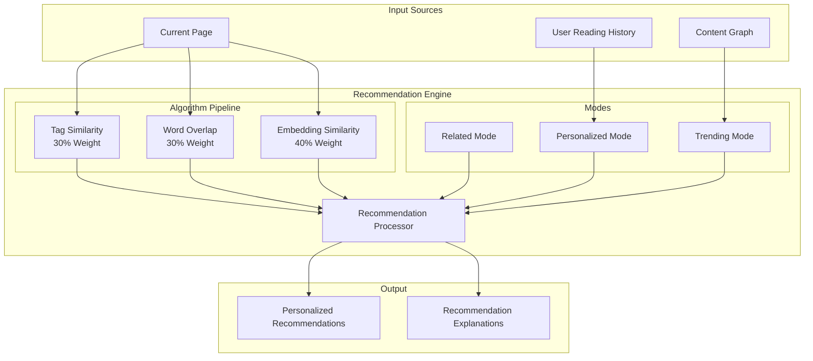

**Configuration Example:**

```typescript
Component.AIRecommendations({
  mode: "personalized",
  explanations: true,
  maxItems: 5,
  title: "Recommended for You",
  showDescription: true,
})
```

**Garden Post**: [[docs/ai-features-documentation|AI Features Documentation]] - Complete technical documentation

### AI Writing Assistant

In-browser writing help that can suggest improvements, generate content, or help with brainstorming. Integrates seamlessly with the markdown editor for real-time assistance.

**Technical Implementation:**

- **Component**: `quartz/components/AIWritingAssistant.tsx`
- **Features**: Grammar checking, style improvements, content suggestions, text completion
- **Providers**: OpenAI, Anthropic, local models, mock (for demo)
- **Position**: Floating button accessible from any content page
- **API Integration**: Edge functions for secure LLM access

**Writing Assistant Architecture:**

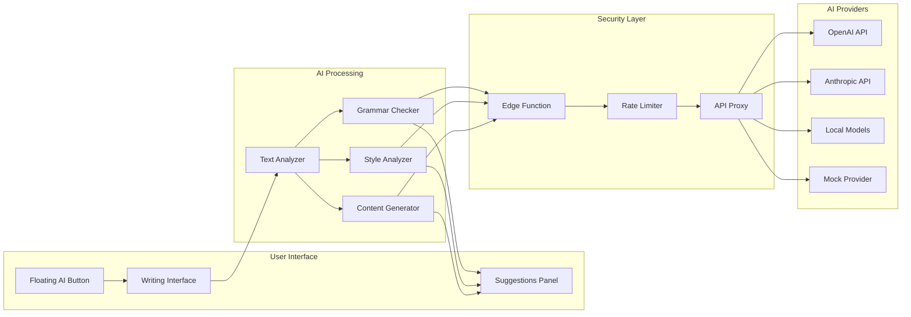

**Configuration Example:**

```typescript
Component.AIWritingAssistant({
  features: ["grammar", "style", "suggestions", "completion"],
  provider: "openai",
  position: "floating",
  apiEndpoint: "/api/ai-assistant",
  cacheStrategy: "moderate",
})
```

**Garden Post**: [[blog/ai-features-showcase|AI Features Showcase]] - Writing assistant features and usage

### Semantic Link Generation

Automatically discovers and creates meaningful connections between content pieces. Uses AI to identify related concepts and generate contextual links that help users navigate the knowledge graph.

**Technical Implementation:**

- **Component**: `quartz/components/SemanticLinks.tsx`
- **Core Engine**: `quartz/util/semantic.ts`
- **Analysis**: TensorFlow.js Universal Sentence Encoder
- **Similarity**: Cosine similarity with sentiment-aware weighting
- **Visual Indicators**: Strength-based color coding (strong/medium/weak)
- **Build Integration**: `quartz/plugins/emitters/semanticLinkDiscovery.ts`

**Semantic Link Generation Process:**

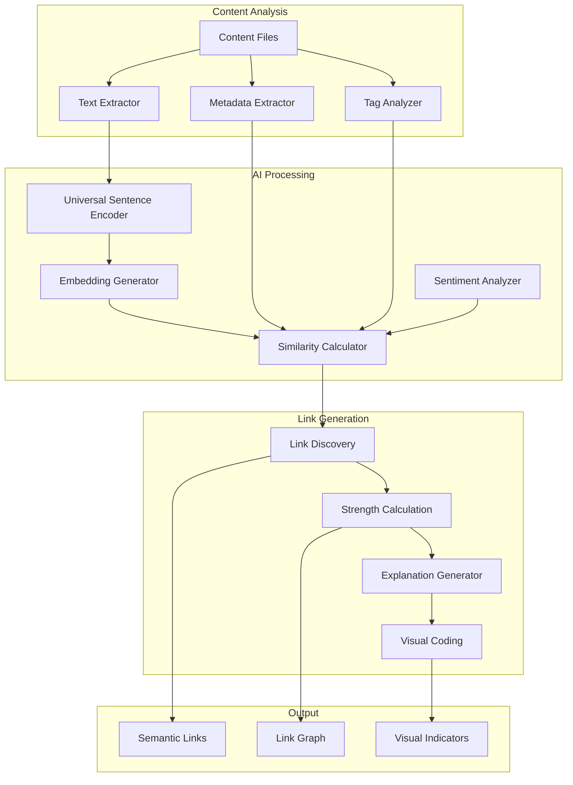

**Configuration Example:**

```typescript
Component.SemanticLinks({
  minSimilarity: 0.3,
  maxLinks: 8,
  showStrength: true,
  showExplanations: true,
  sentimentWeight: 0.3,
})
```

**Garden Post**: [[tools/AI Semantic Links|AI-Powered Semantic Links]] - Complete implementation details and architecture

### Canvas-Based AI Interactions

Interactive canvas elements where users can draw, diagram, or create visual content that AI can analyze, enhance, or respond to. Enables visual AI interactions beyond just text.

**Technical Implementation:**

- **Component**: `quartz/components/CanvasViewer.tsx`
- **Canvas Support**: Obsidian Canvas format with AI enhancements
- **Visual Analysis**: Computer vision models for diagram understanding
- **Integration**: Works with existing canvas files in content
- **AI Features**: Diagram analysis, content suggestions, visual search

**Canvas AI Architecture:**

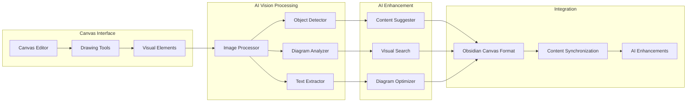

**Configuration Example:**

```typescript
Component.CanvasViewer({
  enableAI: true,
  showAnalysis: true,
  allowEditing: false,
  aiFeatures: ["diagram-analysis", "content-suggestions"],
})
```

**Garden Post**: [[blog/ai-features-showcase|AI Features Showcase]] - Canvas integration and visual AI capabilities

## Technical Architecture

### Build-Time Processing

- **Embeddings Generation**: Pre-computed during build for instant search
- **Semantic Analysis**: Content similarity calculated at build time
- **Index Creation**: Optimized search indices for fast queries
- **Static Assets**: AI models cached as static files

### Client-Side Intelligence

- **WebAssembly**: Near-native performance for AI computations
- **Progressive Enhancement**: Graceful fallbacks when AI unavailable
- **Local Storage**: Personalization data kept in browser
- **Model Caching**: Intelligent caching of AI models

### Privacy & Security

- **No Server Tracking**: All AI features run client-side when possible
- **API Proxies**: Edge functions for secure LLM access
- **Rate Limiting**: Built-in protection against abuse
- **Data Minimization**: Only essential data processed

**Overall System Architecture:**

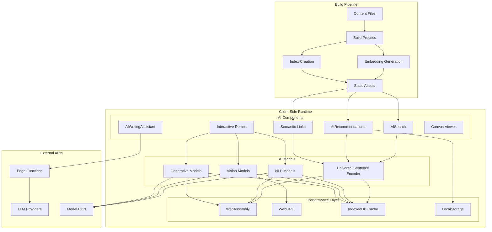

## Technology Choices & Philosophy

### Why TypeScript?

TypeScript was chosen for its type safety and developer experience in AI development:

**Type Safety for AI Models:**

```typescript
interface SemanticEmbedding {
  slug: FullSlug
  embedding: number[] // Fixed 512-dimension vectors
  content: string
  title: string
  tags: string[]
  lastUpdated: Date
}

interface SearchResult {
  slug: FullSlug
  title: string
  content: string
  similarity: number // 0-1 range for semantic similarity
  explanation?: string
  matchType: "keyword" | "semantic" | "hybrid"
}
```

**Benefits for AI Development:**

- **Model Interface Safety**: Ensures AI model inputs/outputs are correctly typed
- **Refactoring Confidence**: Safe to change embedding dimensions or model APIs
- **IDE Support**: Autocomplete for AI component configurations
- **Error Prevention**: Catches type mismatches before runtime
- **Documentation**: Types serve as living documentation for AI features

### Why TensorFlow.js?

TensorFlow.js was selected for its comprehensive ecosystem and browser-first approach:

**Universal Sentence Encoder Implementation:**

```typescript
import * as use from "@tensorflow-models/universal-sentence-encoder"

export class SemanticAnalyzer {
  private model: use.UniversalSentenceEncoder | null = null

  async initialize() {
    this.model = await use.load()
    console.log("Universal Sentence Encoder loaded successfully")
  }

  async generateEmbedding(text: string): Promise<number[]> {
    if (!this.model) {
      throw new Error("Model not initialized")
    }

    const embeddings = await this.model.embed([text])
    const embeddingArray = await embeddings.array()
    return embeddingArray[0] // 512-dimensional vector
  }

  calculateCosineSimilarity(vecA: number[], vecB: number[]): number {
    const dotProduct = vecA.reduce((sum, a, i) => sum + a * vecB[i], 0)
    const magnitudeA = Math.sqrt(vecA.reduce((sum, a) => sum + a * a, 0))
    const magnitudeB = Math.sqrt(vecB.reduce((sum, b) => sum + b * b, 0))
    return dotProduct / (magnitudeA * magnitudeB)
  }
}
```

**TensorFlow.js Advantages:**

- **Browser-Native**: No server required, runs entirely client-side
- **Model Ecosystem**: Access to thousands of pre-trained models
- **Performance**: WebGL acceleration for GPU-accelerated inference
- **Memory Management**: Automatic tensor cleanup and garbage collection
- **Quantization**: Model compression for faster loading
- **Transfer Learning**: Fine-tune models on custom datasets

**TensorFlow.js Architecture:**

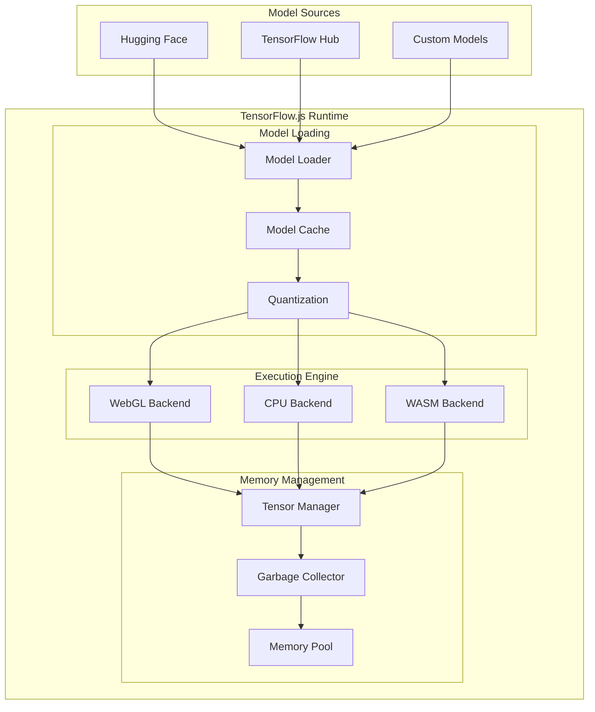

### Why a Digital Garden for AI Development?

The digital garden provides a naturally evolving dataset that's perfect for AI development and learning:

**Natural Data Evolution:**

- **Organic Growth**: Content grows naturally over time, creating realistic training scenarios
- **Diverse Content Types**: Mix of technical docs, personal notes, and creative content
- **Temporal Patterns**: Content creation patterns reveal learning and exploration paths
- **Interconnected Knowledge**: Links between content create rich semantic networks

**Documentation as Development:**

```typescript
// The garden documents its own AI development process
interface GardenPost {
  title: string
  content: string
  tags: string[]
  date: Date
  aiFeatures?: {
    semanticLinks: SemanticLink[]
    recommendations: Recommendation[]
    searchRanking: number
  }
  developmentNotes?: {
    aiImplementation: string
    challenges: string[]
    lessonsLearned: string[]
    nextSteps: string[]
  }
}
```

**Benefits of Garden-Based Development:**

- **Living Documentation**: AI features are documented where they're used
- **Iterative Learning**: Each post can test and refine AI capabilities
- **Real-World Testing**: Features are tested on actual content, not synthetic data
- **Community Feedback**: Garden visitors provide natural user testing
- **Knowledge Preservation**: Development insights become part of the knowledge base

**Digital Garden AI Development Flow:**

```mermaid
graph LR
    subgraph "Content Creation"
        NewPost[New Post Created]
        ContentAnalysis[Content Analysis]
        AITesting[AI Feature Testing]
    end

    subgraph "AI Development"
        FeatureDevelopment[Feature Development]
        RealWorldTesting[Real-World Testing]
        Iteration[Iteration & Refinement]
    end

    subgraph "Knowledge Growth"
        Documentation[Documentation]
        Insights[Development Insights]
        CommunityFeedback[Community Feedback]
    end

    subgraph "Garden Evolution"
        ContentGrowth[Content Growth]
        AIImprovement[AI Improvement]
        KnowledgeAmplification[Knowledge Amplification]
    end

    NewPost --> ContentAnalysis
    ContentAnalysis --> AITesting
    AITesting --> FeatureDevelopment

    FeatureDevelopment --> RealWorldTesting
    RealWorldTesting --> Iteration
    Iteration --> Documentation

    Documentation --> Insights
    Insights --> CommunityFeedback
    CommunityFeedback --> ContentGrowth

    ContentGrowth --> AIImprovement
    AIImprovement --> KnowledgeAmplification
    KnowledgeAmplification --> NewPost
```

## Performance Optimization

### Bundle Size Management

- **Dynamic Imports**: AI components loaded on-demand
- **Model Quantization**: Optimized model sizes for web
- **Tree Shaking**: Unused AI features excluded from builds
- **CDN Integration**: Models served from optimized CDNs

### Runtime Performance

- **Web Workers**: Heavy computations offloaded to background threads
- **IndexedDB**: Local storage for models and embeddings
- **Memory Management**: Automatic cleanup of unused models
- **Caching Strategy**: Intelligent caching with TTL management

**Performance Optimization Architecture:**

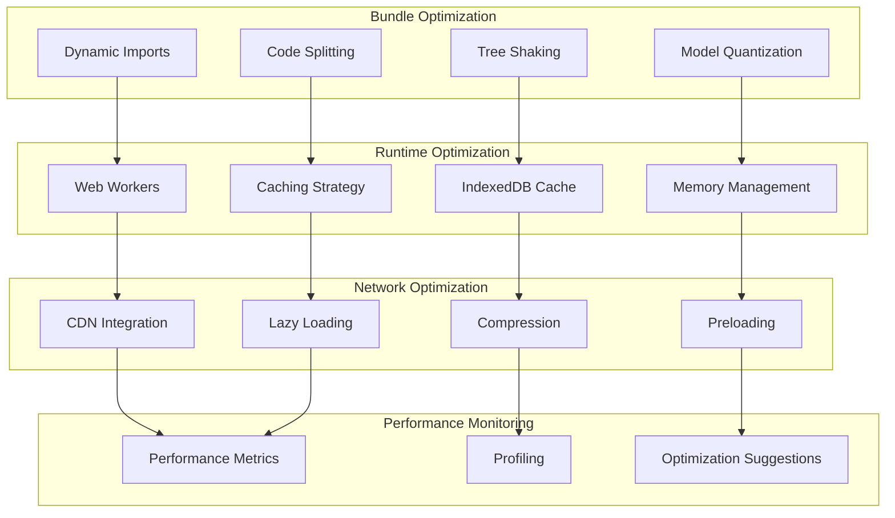

## Development Workflow

### Testing

- **Unit Tests**: `tests/ai-features.test.ts` for component testing
- **Integration Tests**: End-to-end testing of AI workflows
- **Performance Tests**: Load testing for AI components
- **Mock Providers**: Development without API costs

### Debugging

- **Debug Mode**: Enable with `localStorage.setItem("AI_DEBUG", "true")`
- **Console Logging**: Detailed logging for AI operations
- **Performance Monitoring**: Real-time performance metrics
- **Error Boundaries**: Graceful error handling for AI failures

**Development Workflow:**

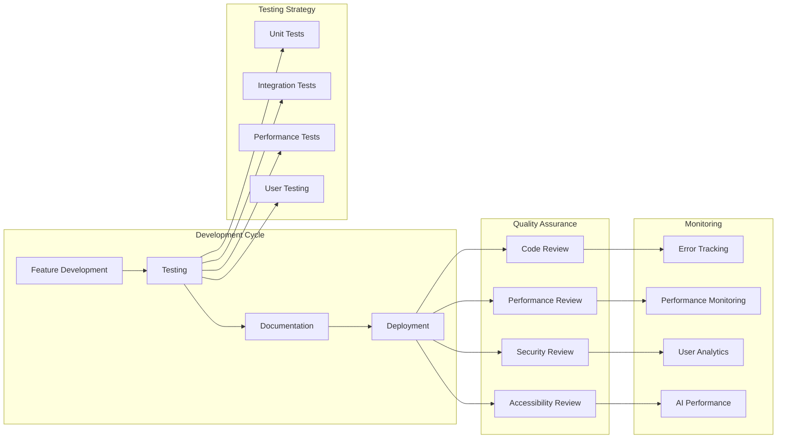

### Development Philosophy

The digital garden serves as both a development environment and a living laboratory for AI research:

**Iterative Development:**

- Each new post can test new AI capabilities
- Real content provides authentic testing scenarios
- Development insights become part of the knowledge base
- Community feedback drives feature evolution

**Documentation-Driven Development:**

- AI features are documented where they're used
- Technical decisions are explained in context
- Learning experiences become shareable knowledge
- The garden grows smarter as it documents its own development

**Knowledge Amplification:**

- AI doesn't replace human intelligence, it amplifies it
- Semantic links reveal connections humans might miss
- Recommendations surface relevant content automatically
- The garden becomes more valuable as it grows

## Contributing

Contributions are welcome! Please feel free to submit a Pull Request.

## License

This project is open source and available under the [MIT License](LICENSE).

## Acknowledgments

- Built on [Quartz](https://quartz.jzhao.xyz/) by Jacky Zhao
- AI features inspired by modern digital garden innovations
- Community feedback and contributions

---

For more information, visit [garden.samlazrak.com](https://garden.samlazrak.com)
