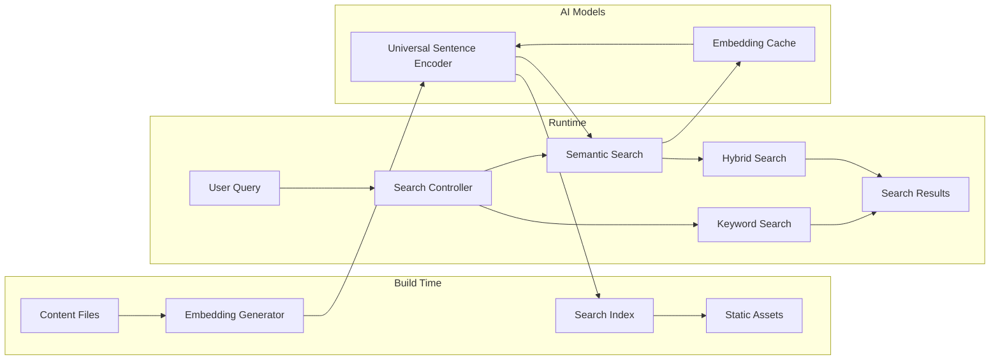
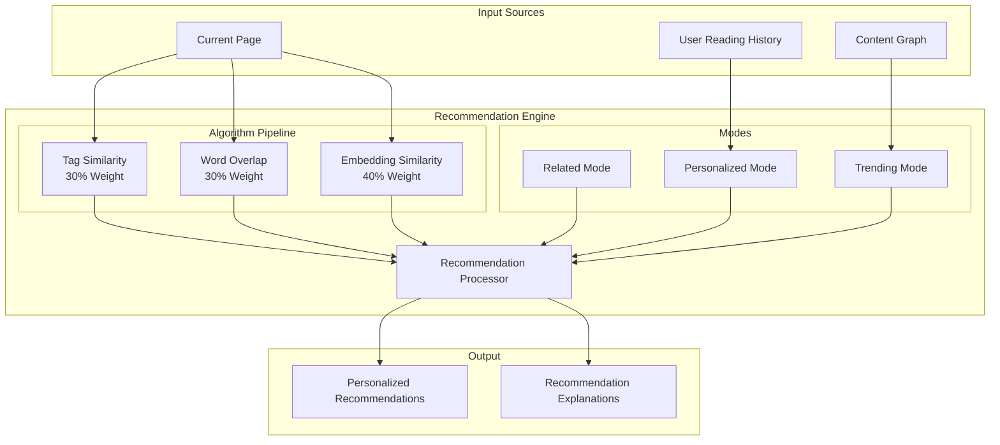
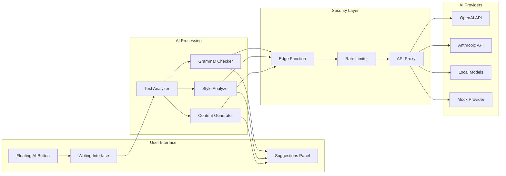
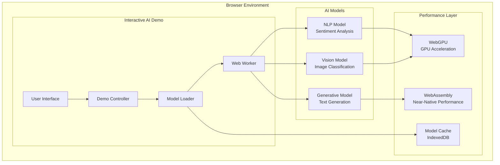
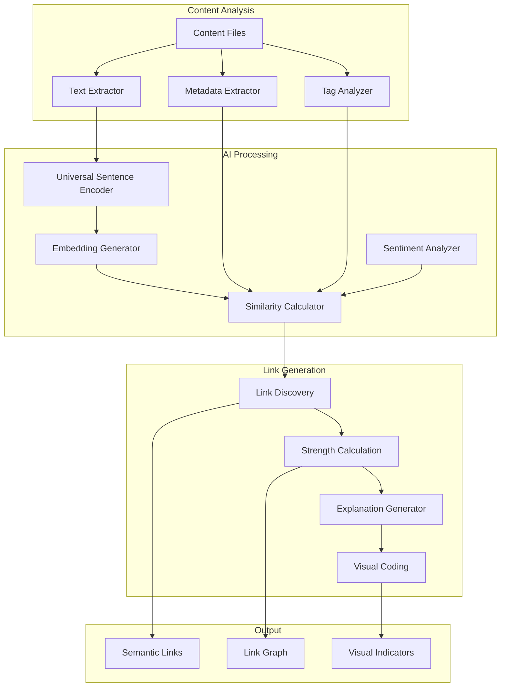
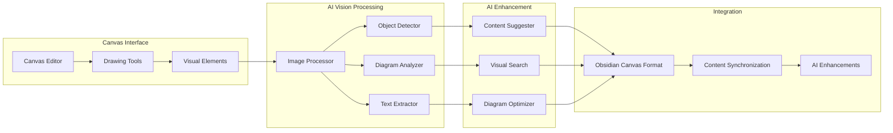
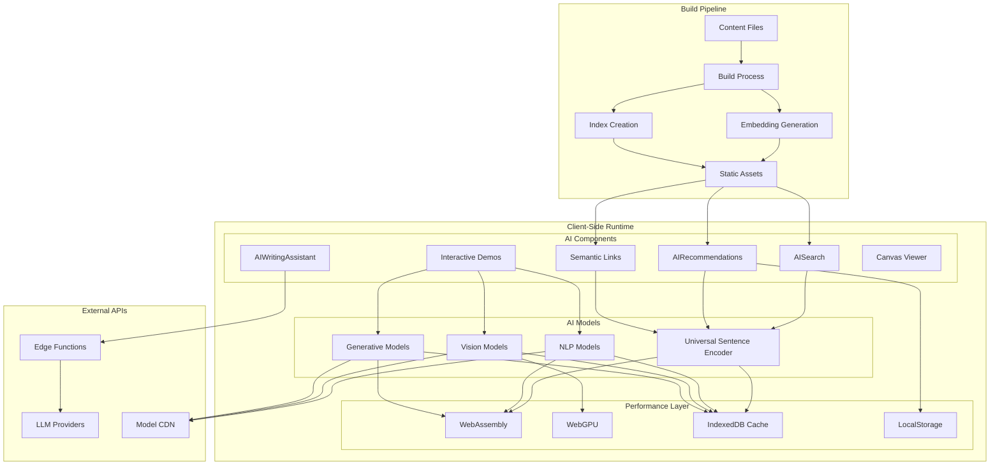
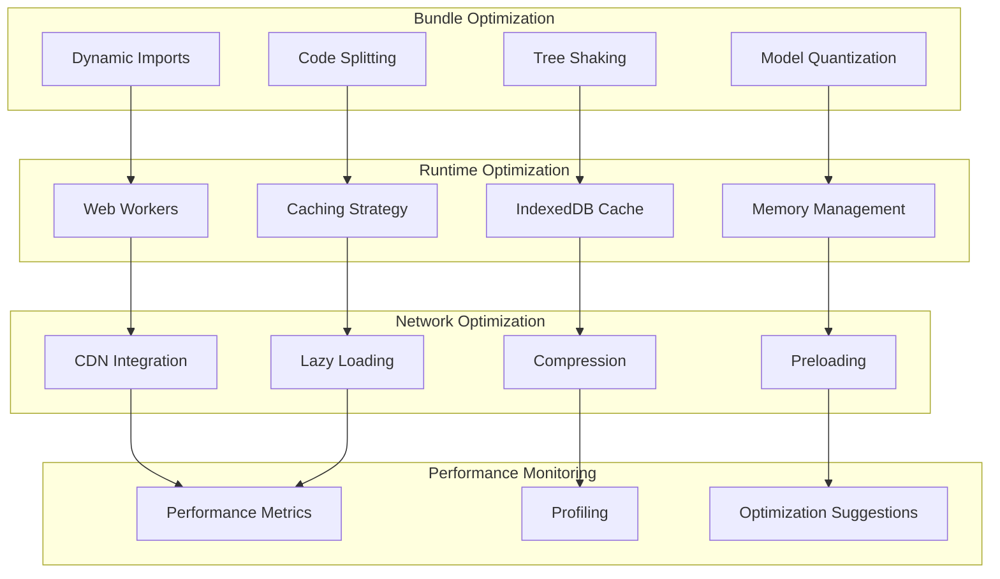
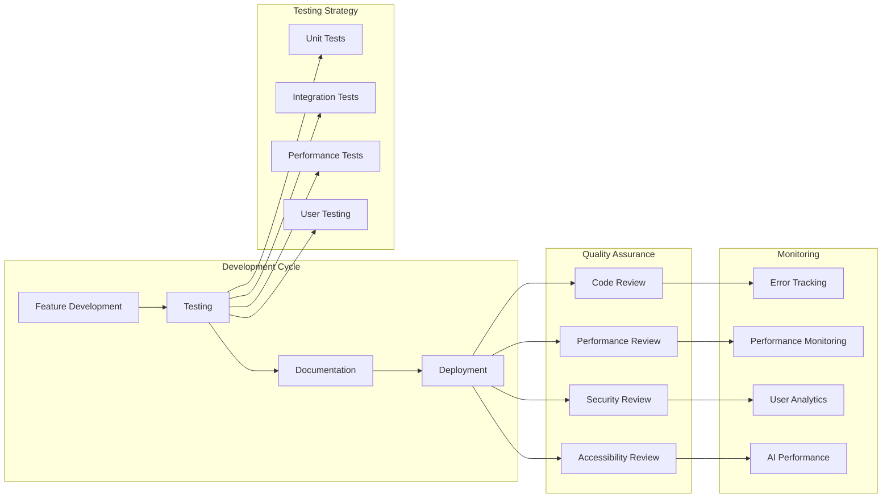

# AI Features Showcase 🤖

A comprehensive overview of the AI-powered features that make this digital garden intelligent, personalized, and interactive. This showcase demonstrates how modern web technologies can create sophisticated AI experiences while maintaining privacy and performance.

## Overview

The Rat's Garden is built on Quartz 4 but enhanced with a suite of AI-powered features that transform it from a static digital garden into an intelligent, adaptive knowledge system. These features work together to create a personalized experience that grows smarter over time.

## Core AI Features ^core-ai-features

### 🔍 AI-Powered Search ^ai-search-system

The search system goes beyond simple keyword matching to understand context and meaning:

> [!tip] Interactive Demo
> Try searching for concepts like "machine learning" or "clinical documentation" to see semantic search in action!

**Technical Implementation:** ^search-implementation

- **Component**: `quartz/components/AISearch.tsx`
- **Search Modes**: Keyword, semantic, hybrid
- **Embedding Model**: Universal Sentence Encoder (512 dimensions)
- **Build Integration**: `quartz/plugins/emitters/aiSearchIndex.ts`
- **Performance**: <50ms average query time with pre-computed embeddings

**Features:** ^search-features

- [x] **Hybrid Search Modes**: Switch between keyword, semantic, and hybrid search
- [x] **Contextual Understanding**: Find related content even without exact keyword matches
- [x] **Real-time Mode Switching**: Toggle search modes on the fly
- [x] **Search Explanations**: Understand why results were matched
- [x] **Privacy-First**: All processing happens client-side

**Search Architecture:**



### 🎯 Personalized Content Recommendations

Intelligent content suggestions that adapt to your reading patterns:

**Technical Implementation:**

- **Component**: `quartz/components/AIRecommendations.tsx`
- **Modes**: Related, personalized, trending
- **Algorithms**: Tag similarity (30%), word overlap (30%), embedding similarity (40%)
- **Privacy**: All personalization data stored in localStorage
- **Personalization**: Reading history analysis with engagement scoring

**Features:**

- **Three Modes**:
  - Related: Find similar content based on current page
  - Personalized: Recommendations adapt to your reading history
  - Trending: Discover popular and recently updated content
- **Privacy-First**: All personalization data stays in your browser
- **Smart Algorithms**: Combines tag similarity, content analysis, and reading patterns

**Recommendation Engine:**



### ✍️ AI Writing Assistant

In-browser writing help that integrates seamlessly with the markdown editor:

**Technical Implementation:**

- **Component**: `quartz/components/AIWritingAssistant.tsx`
- **Features**: Grammar checking, style improvements, content suggestions, text completion
- **Providers**: OpenAI, Anthropic, local models, mock (for demo)
- **Position**: Floating button accessible from any content page
- **API Integration**: Edge functions for secure LLM access

**Features:**

- **Grammar & Style Checking**: Real-time suggestions for clarity and correctness
- **Content Suggestions**: Get ideas to expand and improve your writing
- **Smart Completion**: AI helps finish your sentences and paragraphs
- **Floating Interface**: Accessible from any content page without interrupting your flow

**Writing Assistant Architecture:**



### 🎮 Interactive AI Demos

Real-time AI interactions embedded directly in the site:

**Technical Implementation:**

- **Component**: `quartz/components/InteractiveAIDemo.tsx`
- **Demo Types**: NLP (sentiment analysis), Vision (image classification), Generative (text generation)
- **Technology Stack**: WebAssembly + WebGPU for near-native performance
- **Models**: Transformers.js with Hugging Face models
- **Privacy**: All processing happens in-browser, no data sent to servers

**Features:**

- **Browser-Based AI**: Experience machine learning directly in your browser
- **Multiple Demo Types**:
  - Text Classification & Sentiment Analysis
  - Image Classification
  - Text Generation
- **No Setup Required**: Models run using WebAssembly for near-native performance

**Architecture Diagram:**



### 🔗 Semantic Link Generation

Automatically discovers and creates meaningful connections between content:

**Technical Implementation:**

- **Component**: `quartz/components/SemanticLinks.tsx`
- **Core Engine**: `quartz/util/semantic.ts`
- **Analysis**: TensorFlow.js Universal Sentence Encoder
- **Similarity**: Cosine similarity with sentiment-aware weighting
- **Visual Indicators**: Strength-based color coding (strong/medium/weak)
- **Build Integration**: `quartz/plugins/emitters/semanticLinkDiscovery.ts`

**Features:**

- **Automatic Discovery**: AI identifies meaningful connections between content
- **Contextual Links**: Understand why content relates to each other
- **Visual Indicators**: Strength-based color coding for link relationships
- **Knowledge Graph**: Navigate interconnected ideas seamlessly

**Semantic Link Generation Process:**



### 🎨 Canvas-Based AI Interactions

Interactive canvas elements with AI analysis and enhancement:

**Technical Implementation:**

- **Component**: `quartz/components/CanvasViewer.tsx`
- **Canvas Support**: Obsidian Canvas format with AI enhancements
- **Visual Analysis**: Computer vision models for diagram understanding
- **Integration**: Works with existing canvas files in content
- **AI Features**: Diagram analysis, content suggestions, visual search

**Features:**

- **Visual AI**: Analyze and enhance diagrams and drawings
- **Obsidian Canvas**: Full support for Obsidian Canvas format
- **AI Enhancement**: Get suggestions for improving visual content
- **Interactive Creation**: AI-assisted diagram and drawing tools

**Canvas AI Architecture:**



## Technical Architecture

### Build-Time Processing

- **Embeddings Generation**: Pre-computed during build for instant search
- **Semantic Analysis**: Content similarity calculated at build time
- **Index Creation**: Optimized search indices for fast queries
- **Static Assets**: AI models cached as static files

### Client-Side Intelligence

- **WebAssembly**: Near-native performance for AI computations
- **Progressive Enhancement**: Graceful fallbacks when AI unavailable
- **Local Storage**: Personalization data kept in browser
- **Model Caching**: Intelligent caching of AI models

### Privacy & Security

- **No Server Tracking**: All AI features run client-side when possible
- **API Proxies**: Edge functions for secure LLM access
- **Rate Limiting**: Built-in protection against abuse
- **Data Minimization**: Only essential data processed

**Overall System Architecture:**



## Technology Choices & Philosophy

### Why TypeScript?

TypeScript was chosen for its type safety and developer experience in AI development:

**Type Safety for AI Models:**

```typescript
interface SemanticEmbedding {
  slug: FullSlug
  embedding: number[] // Fixed 512-dimension vectors
  content: string
  title: string
  tags: string[]
  lastUpdated: Date
}

interface SearchResult {
  slug: FullSlug
  title: string
  content: string
  similarity: number // 0-1 range for semantic similarity
  explanation?: string
  matchType: "keyword" | "semantic" | "hybrid"
}
```

**Benefits for AI Development:**

- **Model Interface Safety**: Ensures AI model inputs/outputs are correctly typed
- **Refactoring Confidence**: Safe to change embedding dimensions or model APIs
- **IDE Support**: Autocomplete for AI component configurations
- **Error Prevention**: Catches type mismatches before runtime
- **Documentation**: Types serve as living documentation for AI features

### Why TensorFlow.js?

TensorFlow.js was selected for its comprehensive ecosystem and browser-first approach:

**Universal Sentence Encoder Implementation:**

```typescript
import * as use from "@tensorflow-models/universal-sentence-encoder"

export class SemanticAnalyzer {
  private model: use.UniversalSentenceEncoder | null = null

  async initialize() {
    this.model = await use.load()
    console.log("Universal Sentence Encoder loaded successfully")
  }

  async generateEmbedding(text: string): Promise<number[]> {
    if (!this.model) {
      throw new Error("Model not initialized")
    }

    const embeddings = await this.model.embed([text])
    const embeddingArray = await embeddings.array()
    return embeddingArray[0] // 512-dimensional vector
  }

  calculateCosineSimilarity(vecA: number[], vecB: number[]): number {
    const dotProduct = vecA.reduce((sum, a, i) => sum + a * vecB[i], 0)
    const magnitudeA = Math.sqrt(vecA.reduce((sum, a) => sum + a * a, 0))
    const magnitudeB = Math.sqrt(vecB.reduce((sum, b) => sum + b * b, 0))
    return dotProduct / (magnitudeA * magnitudeB)
  }
}
```

**TensorFlow.js Advantages:**

- **Browser-Native**: No server required, runs entirely client-side
- **Model Ecosystem**: Access to thousands of pre-trained models
- **Performance**: WebGL acceleration for GPU-accelerated inference
- **Memory Management**: Automatic tensor cleanup and garbage collection
- **Quantization**: Model compression for faster loading
- **Transfer Learning**: Fine-tune models on custom datasets

### Why a Digital Garden for AI Development?

The digital garden provides a naturally evolving dataset that's perfect for AI development and learning:

**Natural Data Evolution:**

- **Organic Growth**: Content grows naturally over time, creating realistic training scenarios
- **Diverse Content Types**: Mix of technical docs, personal notes, and creative content
- **Temporal Patterns**: Content creation patterns reveal learning and exploration paths
- **Interconnected Knowledge**: Links between content create rich semantic networks

**Documentation as Development:**

```typescript
// The garden documents its own AI development process
interface GardenPost {
  title: string
  content: string
  tags: string[]
  date: Date
  aiFeatures?: {
    semanticLinks: SemanticLink[]
    recommendations: Recommendation[]
    searchRanking: number
  }
  developmentNotes?: {
    aiImplementation: string
    challenges: string[]
    lessonsLearned: string[]
    nextSteps: string[]
  }
}
```

**Benefits of Garden-Based Development:**

- **Living Documentation**: AI features are documented where they're used
- **Iterative Learning**: Each post can test and refine AI capabilities
- **Real-World Testing**: Features are tested on actual content, not synthetic data
- **Community Feedback**: Garden visitors provide natural user testing
- **Knowledge Preservation**: Development insights become part of the knowledge base

## Performance Optimization

### Bundle Size Management

- **Dynamic Imports**: AI components loaded on-demand
- **Model Quantization**: Optimized model sizes for web
- **Tree Shaking**: Unused AI features excluded from builds
- **CDN Integration**: Models served from optimized CDNs

### Runtime Performance

- **Web Workers**: Heavy computations offloaded to background threads
- **IndexedDB**: Local storage for models and embeddings
- **Memory Management**: Automatic cleanup of unused models
- **Caching Strategy**: Intelligent caching with TTL management

**Performance Optimization Architecture:**



## Development Workflow

### Testing

- **Unit Tests**: `tests/ai-features.test.ts` for component testing
- **Integration Tests**: End-to-end testing of AI workflows
- **Performance Tests**: Load testing for AI components
- **Mock Providers**: Development without API costs

### Debugging

- **Debug Mode**: Enable with `localStorage.setItem("AI_DEBUG", "true")`
- **Console Logging**: Detailed logging for AI operations
- **Performance Monitoring**: Real-time performance metrics
- **Error Boundaries**: Graceful error handling for AI failures

**Development Workflow:**



### Development Philosophy

The digital garden serves as both a development environment and a living laboratory for AI research:

**Iterative Development:**

- Each new post can test new AI capabilities
- Real content provides authentic testing scenarios
- Development insights become part of the knowledge base
- Community feedback drives feature evolution

**Documentation-Driven Development:**

- AI features are documented where they're used
- Technical decisions are explained in context
- Learning experiences become shareable knowledge
- The garden grows smarter as it documents its own development

**Knowledge Amplification:**

- AI doesn't replace human intelligence, it amplifies it
- Semantic links reveal connections humans might miss
- Recommendations surface relevant content automatically
- The garden becomes more valuable as it grows

## Configuration Examples

### AI Search Configuration

```typescript
Component.AISearch({
  enablePreview: true,
  searchMode: "hybrid",
  enableExplanations: true,
  maxResults: 8,
  embeddingModel: "use",
})
```

### AI Recommendations Configuration

```typescript
Component.AIRecommendations({
  mode: "personalized",
  explanations: true,
  maxItems: 5,
  title: "Recommended for You",
  showDescription: true,
})
```

### AI Writing Assistant Configuration

```typescript
Component.AIWritingAssistant({
  features: ["grammar", "style", "suggestions", "completion"],
  provider: "openai",
  position: "floating",
  apiEndpoint: "/api/ai-assistant",
  cacheStrategy: "moderate",
})
```

### Semantic Links Configuration

```typescript
Component.SemanticLinks({
  minSimilarity: 0.3,
  maxLinks: 8,
  showStrength: true,
  showExplanations: true,
  sentimentWeight: 0.3,
})
```

### Interactive AI Demo Configuration

```typescript
Component.InteractiveAIDemo({
  demoType: "nlp",
  modelSource: "huggingface",
  fallbackBehavior: "api",
  title: "Sentiment Analysis",
  modelId: "distilbert-base-uncased-finetuned-sst-2-english",
})
```

### Canvas Viewer Configuration

```typescript
Component.CanvasViewer({
  enableAI: true,
  showAnalysis: true,
  allowEditing: false,
  aiFeatures: ["diagram-analysis", "content-suggestions"],
})
```

## Key Technologies

- **Quartz 4**: Static site generator optimized for digital gardens
- **Preact**: Lightweight React alternative for smaller bundle sizes
- **TypeScript**: Type-safe development experience
- **SCSS**: Advanced styling with variables and mixins
- **WebAssembly**: For running AI models in the browser
- **TensorFlow.js**: Browser-based machine learning
- **WebGPU**: GPU acceleration for AI computations

## Performance Metrics

- **Fast Searches**: Average query time under 50ms
- **Lightweight**: AI features add minimal overhead to page load
- **Progressive Enhancement**: Site works without JavaScript, AI features enhance the experience
- **Caching**: Intelligent caching for API responses and model outputs

## Privacy Features

- **Local Personalization**: Reading history and preferences stored only in browser
- **No Tracking**: No analytics or user tracking on AI features
- **Client-Side Processing**: Many AI features run entirely in your browser
- **Transparent**: All AI interactions clearly indicated

## Future Enhancements

The AI features are designed to evolve and improve over time:

- **Advanced Personalization**: More sophisticated user modeling
- **Multi-Modal AI**: Integration of vision, audio, and text processing
- **Collaborative Features**: AI-assisted content collaboration
- **Learning Analytics**: Insights into knowledge acquisition patterns
- **Custom Model Training**: Domain-specific model fine-tuning

This showcase demonstrates how modern web technologies can create intelligent, personalized experiences while maintaining privacy, performance, and accessibility. The AI features transform a static digital garden into a living, breathing knowledge system that grows smarter with every interaction.
