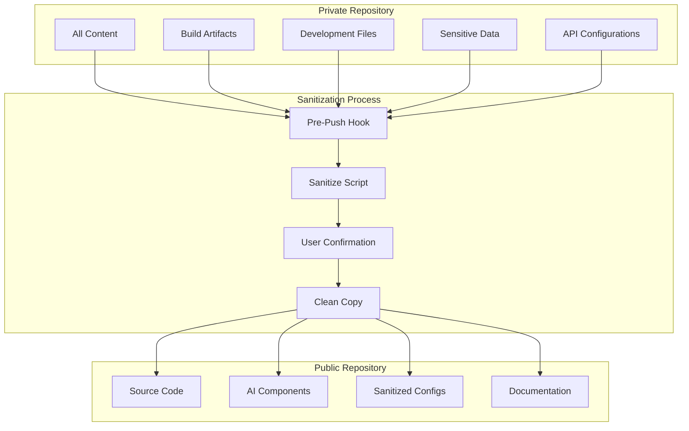

# Public/Private Repository System 🔒

This digital garden uses a sophisticated sanitization system to maintain both a private development repository and a public showcase repository. This system ensures that sensitive content, API keys, and private development files remain secure while still allowing the AI features to be publicly demonstrated.

## Overview

The system consists of two repositories:

- **Private Repository**: Contains everything - all content, build artifacts, development files, and sensitive data
- **Public Repository**: Contains only the source code needed to showcase AI features - sanitized and cleaned

## How It Works

### Automatic Sanitization Process

1. **Trigger**: When code is pushed to the `main` branch, a pre-push Git hook automatically runs
2. **Sanitization**: A TypeScript script creates a clean copy with sensitive data removed
3. **User Confirmation**: The system waits for explicit user approval before pushing to the public repository
4. **Public Push**: The sanitized version is pushed to the public showcase repository

### What Gets Sanitized

**Files Removed:**

- `api/ai-assistant.js` (contains API keys)
- `private/` directory
- All `.env` files
- Draft posts (files with `draft: true` in frontmatter)
- `node_modules/` (dependencies)
- `public/` (build output)
- `.quartz-cache/` (build cache)
- `.vscode/` (IDE settings)
- `.claude/` (AI assistant data)
- `.idea/` (IDE settings)
- Other build artifacts and temporary files

**Content Sanitized:**

- API keys and secrets removed from configuration files
- Sensitive patterns stripped from code files
- Test files containing secrets removed

### Enhanced Security Features

- **Comprehensive `.gitignore`**: Ensures sensitive files are never accidentally committed
- **Environment Variables**: All secrets excluded from public repository
- **Private Content**: Draft posts and private content filtered out
- **IDE Settings**: Development environment data kept private
- **API Key Patterns**: Replaced with sanitized versions (sk-\*\*\*)
- **Content Scanning**: Files scanned and cleaned for sensitive patterns

## System Architecture



## Safety Features

### Non-Blocking Operation

- If sanitization fails, the original push still succeeds
- Never blocks development workflow
- Graceful error handling with comprehensive logging

### User Control

- Requires explicit user approval before pushing to public repository
- Clear feedback about what's happening during the process
- Option to skip public push if needed

### Secure Processing

- All work done in temporary directories
- Automatic cleanup after processing
- No sensitive data left in temporary locations

### Force Push Strategy

- Uses `--force` to ensure public repository is completely replaced
- Prevents accumulation of sensitive data over time
- Maintains clean, current state of public showcase

## Configuration

The sanitization system is highly configurable through `sanitize-config.json`:

```json
{
  "publicRepoUrl": "git@github.com:samlazrak/RatGarden-Public.git",
  "filesToRemove": ["api/ai-assistant.js", "private/", ".env*", "*.env"],
  "patternsToRemove": ["api_key", "apiKey", "API_KEY", "secret", "password", "token"],
  "directoriesToScan": ["content/", "scripts/", "docs/"]
}
```

## Manual Usage

While the system runs automatically, it can also be used manually:

```bash
# Run the full sanitization and push
npx tsx scripts/sanitize.ts

# Test the script without pushing
npx tsx scripts/sanitize.ts --dry-run

# Run comprehensive tests
npx tsx scripts/test-sanitization.ts
```

## Troubleshooting

### Common Issues

1. **SSH Key Issues**: Ensure SSH keys are set up for both repositories
2. **Permission Denied**: Make sure scripts are executable
3. **Public Repo Not Found**: Create the public repository first on GitHub

### Debug Mode

Add `--debug` flag for verbose output:

```bash
npx tsx scripts/sanitize.ts --debug
```

## Security Philosophy

### Defense in Depth

- Multiple layers of protection against data exposure
- Pattern-based detection of sensitive information
- Comprehensive file filtering and content scanning

### Transparency

- Clear documentation of what gets removed
- User confirmation before any public operations
- Detailed logging of sanitization process

### Minimal Exposure

- Only essential code is exposed publicly
- No development history or sensitive metadata
- Clean, professional showcase repository

## Benefits

### For Development

- Secure development environment with all tools and data
- No risk of accidentally exposing sensitive information
- Full access to development history and debugging tools

### For Showcase

- Clean, professional public repository
- Focus on AI features and implementation
- No sensitive data or development artifacts
- Easy for others to learn from and contribute to

### For Security

- Complete separation of private and public data
- Automated protection against accidental exposure
- Comprehensive sanitization of all sensitive patterns

## Repository Structure

### Private Repository Contains

- All content files and media
- Build outputs and cache
- Development scripts and tests
- IDE settings and AI assistant data
- API keys and configuration
- Draft posts and private content

### Public Repository Contains

- Quartz 4 static site generator code
- AI components and scripts
- Configuration files (sanitized)
- Documentation for AI features
- No content, no build artifacts, no private files

## Single Commit History

The public repository maintains a single commit history approach:

- Each sanitization creates a completely fresh copy
- All sensitive data and private content is removed
- The sanitized version is pushed with `--force`
- This keeps the public repo clean and current
- No development history is exposed for security purposes

**Note**: This is a demo repository approach - not how actual repositories are typically managed in production environments.

## Customization

### Adding New Patterns

Edit `sanitize-config.json` to add new sensitive patterns:

```json
{
  "patternsToRemove": [
    "api_key",
    "apiKey",
    "API_KEY",
    "secret",
    "password",
    "token",
    "your_new_pattern"
  ]
}
```

### Excluding Additional Files

Add new file patterns to remove:

```json
{
  "filesToRemove": ["api/ai-assistant.js", "private/", ".env*", "*.env", "your_sensitive_file.js"]
}
```

This sanitization system ensures that the digital garden can serve both as a secure development environment and a public showcase of AI features, maintaining the perfect balance between functionality and security.
